## 1，板卡概述

本文档采用git工具进行管理，文档托管地址为  https://github.com/Digital-Blocks-design/ZYNQ_CORE_484 ，访问该地址，查看最新版的文档信息。

此款开发板使用的是 Xilinx 公司的 Zynq7000 系列的芯片，型号为 XC7Z020-2CLG484I，484 个引脚的 FBGA 封装。ZYNQ7000 芯片可成处理器系统部分 Processor System（PS）和可编程逻辑部分 Programmable Logic（PL）。在 该开发板上，ZYNQ7000 的 PS部分和 PL 部分都搭载了丰富的外部接口和设备，方便用户的使用和功能验证。另外开发板上集成了 JTAG_UART 下载器电路，用户只用一个 USB 线就可以对开发板进行下载和调试。下图为整个板卡的系统组成图 ：

该开发平台定位于初学者的入门学习以及功能开发验证使用。

**开发平台所能含有的接口和功能如下：**

- USB TYPE-C电源输入接口，支持DP协议电源输入 ，支持5V,9V,12V 等电压配置，默认输入配置为12V ；

- 采用 TI的型号为 TPS82130SILT的 MicroSiP 电源模块  ，为板上提供 1.0V， 1.5V，1.8V，3.3V，5.0V等多路供电 ；

- Xilinx ARM+FPGA 芯片 Zynq-7000 XC7Z020-2CLG484I

- 两片大容量的 4Gbit（共 8Gbit）高速 DDR3 SDRAM,可作为 ZYNQ 芯片数据的缓存，也可以作为操作系统运行的内存 ， DDR型号为 MT41K256M16TW-107IT 。

- 一片 256Mbit 的 QSPI FLASH, 可用作 ZYNQ 芯片的系统文件和用户数据的存储 ，flash型号为 N25Q128A13ESE40F ;

- 1 路 Micro SD 卡座，用于存储操作系统镜像和文件系统。

- 一片EMMC芯片  ，容量为 8Gbytes , 用于存储操作系统镜像和文件系统 ， 型号为 MTFC8GAKAJCN-4M。 

- 一路10/100M/1000M以太网RJ-45接口, 可用于和电脑或其它网络设备进行以太网数据交换;

- 一路 HDMI 图像视频输出接口, 能实现 1080P 的视频图像传输；

- 板载一个 33.333Mhz 的有源晶振，给 PS 系统提供稳定的时钟源，一个 50MHz 的有源晶振，为 PL 逻辑提供额外的时钟；

- 一路 USB JTAG 口，集成有JTAG和UART功能，通过 USB 线及板载的 JTAG 电路对 ZYNQ 系统进行调试和下载。

- 一片 IIC 接口的 EEPROM ，型号为 M24C08-WDW6TP ， 容量为 1Kbytes;

- 通过跳线帽进行启动模式修改，支持JTAG，SD卡，FLASH启动模式，方便用户开发调试 。

- 一路USB接口  ， 可用于开发板连接鼠标、键盘和 U 盘等 USB 外设;

- 2个FPGA状态指示灯（DONE ， INIT_B），用于方便查看FPGA的状态 。

- 2 个系统复位按键， 采用专用的复位芯片，用于控制芯片的系统复位 ；

- 4 个用户发光二极管 LED，包括2个单色LED和2个RBG LED ，均连接在PL端进行控制;

- 2 个 PL 控制按键，4个微型拨码开关，均连接在PL端。

- 一片IIC接口的温度传感器芯片，可用于检测环境温度。

- LCD屏幕接口，采用RGB888时序接口，支持显示屏幕 以及触摸功能。

- 板卡设计有OLCD屏幕接口，采用IIC接口，支持简单内容的显示。

- 一路风扇控制接口，12V供电，支持PWM风扇调速 。

- 2 路 40 针的扩展口（2.54mm 间距），用于扩展 ZYNQ 的 PL 部分的 IO。

    

## **2，结构尺寸**

开发板的尺寸为精简的 80mm x 75mm, PCB 采用 10 层板设计。板子四周有 4 个螺丝定位孔，用于固定开发板，定位孔的孔径为 2.5mm(直径），下图为整个板卡的结构示意图： 

**板卡实物图如下 ：**

## 3，电源设计

### 3.1 电源输入

采用USB TYPE-C电源输入为板卡供电，供电的USB连接器位号为 J21，LED9为电源输入指示灯 ，当电源输入有效时，LED9点亮 。

### 3.2 PD协议

通过CH224K芯片提供 PD 供电支持 ，支持5V,9V,12V 等电压请求，默认输入配置为12V 。

 CH224 单芯片集成 USB PD 等多种快充协议，支持 PD3.0/2.0，BC1.2 等升压快充协议，支持 4V 至 22V 输入电压，自动检测VCONN 及模拟 E-Mark 芯片，最高支持 100W 功率，内置 PD 通讯模块，集成度高，外围精简。集成输出电压检测功能，并且提供过温、过压保护等功能。可广泛应用于各类电子设备拓展高功率输入如无线充电器、电动牙刷、充电剃须刀、锂电池电动工具等各类应用场合。

CH224K 使用 Type-C 母口供电，电平配置支持 5/9/12/15/20V（图中电平方式配置为 12v），通过修改 CFG1 ，CFG2，CFG3的连接关系来配置请求电压 ，用户可修改 CFG 引脚的配置来调整输入请求电压 。 实际请求的电压取决于电源适配器支持的输出模式  。

### 3.3 排针供电

板卡还设计有一路排针的电源接口 ，可作为电源输入或输出使用 。排针位号为 J6 ， 为 2.54mm 间距的 4PIN 单排排针 。

当用户不方便使用 Type-C 接口供电时， 也可使用该排针接口为板卡进行供电 ，输入电压支持  5V- 15V 范围 。

或者使用 Type-C 接口供电时，该接口也可支持为其他模块提供供电 。

### 3.4 电源模块 

采用 TI的型号为 TPS82130SILT的 MicroSiP 电源模块  ，为板上提供 1.0V， 1.5V，1.8V，3.3V，5.0V等多路供电 ；通过 TI 的 TPS51200 生成 DDR3 需要的 VTT 和 VREF 电压。

TPS82130 是一款 17V 输入 3A 降压转换器 MicroSiP 电源模块，经优化具有小解决方案尺寸和高效率等特性。该模块集成了一个同步降压转换器和一个电感器，以简化设计、减少外部元件数量并缩小 PCB 面积。该模块采用紧凑的薄型封装，适合通过标准表面贴装设备进行自动组装。

TPS51200 器件是一款灌电流和拉电流双倍数据速率 (DDR) 终端稳压器，专门针对低输入电压、低成本、低噪声的空间受限型系统而设计。

各个电源分配的功能如下表所示：

| **电源**  | **功能**                                                     |
| --------- | ------------------------------------------------------------ |
| +1.0V     | ZYNQ的核心电压                                               |
| +1.5V     | DDR3 ,  ZYNQ Bank502                                         |
| +1.8V     | ZYNQ 辅助电压, ZYNQ PLL, ZYNQ Bank501 VCCIO, 以太网，USB2.0 等 |
| +3.3V     | ZYNQ  VCCIO, 以太网，串口，HDMI ，FLASH,  EEPROM  ，  SD card 等 |
| +5.0V     | LCD ，HDMI ， 扩展接口                                       |
| VREF, VTT | DDR3                                                         |

因为 ZYNQ 的 PS 和 PL 部分的电源有上电顺序的要求，在电路设计中，按照ZYQN 的电源要求设计，上电依次为 1.0V -> 1.5V -> 1.8 V -> 3.3V -> 5.0V 。下图为电源的电路设计：

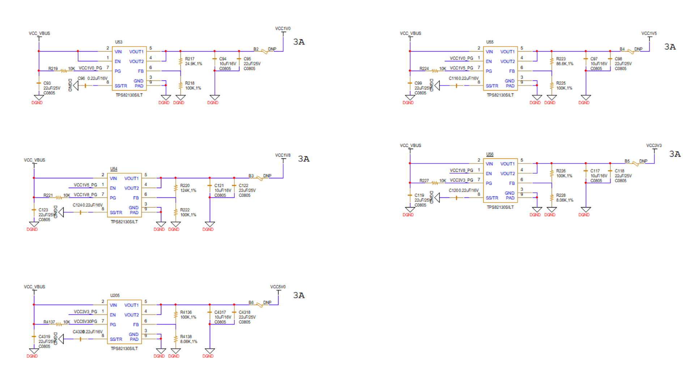

### 3.5 **FPGA供电系统**

ZYNQ 芯片的电源分 PS 系统部分和 PL逻辑部分，两部分的电源分别是独立工作。PS 系统部分的电源和 PL 逻辑部分的电源都有上电
顺序，不正常的上电顺序可能会导致 ARM 系统和 FPGA 系统无法正常工作。

PS 部分的电源有 VCCPINT、VCCPAUX、VCCPLL 和 PS VCCO。VCCPINT 为 PS 内核供电引脚，接 1.0V；VCCPAUX 为 PS 系统辅助供电引脚，接 1.8V；VCCPLL 为 PS 的内部时钟PLL 的电源供电引脚，也接 1.8V；PS VCCO 为 BANK 的电压，包含 VCCO_MIO0，CCO_MIO1
和 VCCO_DDR，根据连接的外设不同，连接的电源电源也会不同，在该核心板上，VCC_MIO0 连接 3.3V， VCCO_MIO1 连接 1.8V，VCCO_DDR 连接 1.5V。PS 系统要求上电顺序分别为先 VCCPINT 供电，然后 VCCPAUX 和 VCCPLL，最后为 PS VCCO。断电的顺序则相反。

PL 部分的电源有 VCCINT, VCCBRAM, VCCAUX 和 VCCO。VCCPINT 为 FPGA 内核供电引脚，接 1.0V；VCCBRAM 为 FPGA Block RAM 的供电引脚；接 1.0V；VCCAUX 为 FPGA辅助供电引脚, 接 1.8V；VCCO 为 PL 的各个 BANK 的电压，包含 BANK13，BANK34，BANK35，在 AX7020 开发板上，BANK 的电压连接 3.3V。PL 系统要求上电顺序分别为先VCCINT 供电，再是 VCCBRAM, 然后是 VCCAUX，最后为 VCCO。如果 VCCINT 和 VCCBRAM的电压一样，可以同时上电。断电的顺序则相反。

## 4，ZYNQ7000

### 4.1 主芯片介绍

开发板使用的是 Xilinx 公司的 Zynq7000 系列的芯片，型号为 XC7Z020-2CLG484I。

zynq7000系列的结构如下图所示。芯片的 PS 系统集成了两个 ARM Cortex™-A9 处理器，AMBA®互连，内部存储器，外部存储器接口和外设，外设主要包括 USB 总线接口，以太网接口，SD/SDIO 接口，I2C 总线接口，CAN 总线接口，UART 接口，GPIO 等。

PL端结构与A7系列相似，大体就包括电源模块、时钟CMT、IO模块（IOB、GTP、memory interface、pcie）、CLB、BRAM、GTP、DSP、jtag调试口等。

PS端包含1个APU单元，APU内有两个cotex-a9核用于运算，一个SCU用于处理数据的一致性，然后包含L1、L2级缓存，一个GIC用于中断控制，一个256KB SRAM用于程序运行，另外包含TTC、看门狗、DAP调试口等。PS端还包含一个Central Interconnect，用于互连IOP（CAN、SPI、UART、SD、USB、ETHERNET等外设），互连flash，互连DDR，互连OCM Interconnect。PS端还包含clock生成模块、复位模块等。

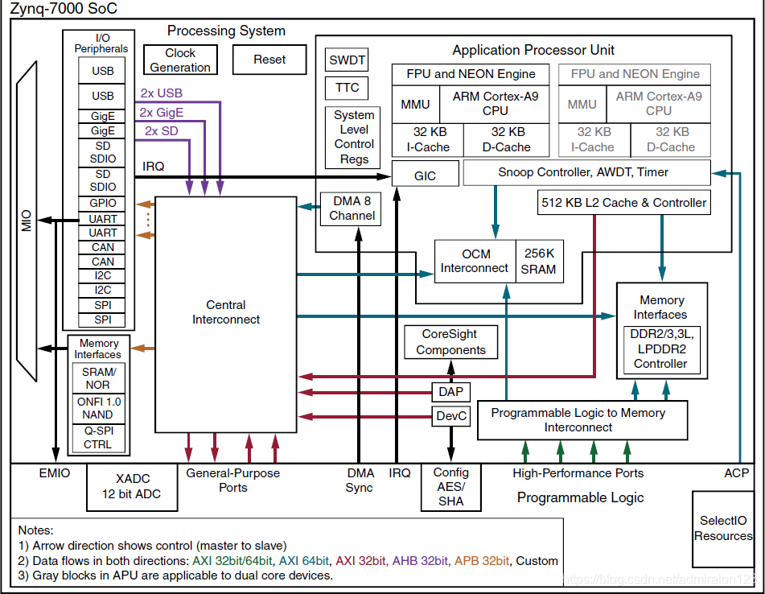

### 4.2 ZYNQ7000命名规则

Zynq其命名规则遵循一定的规则和约定。型号由系列代号，数字序列，速度等级，封装类型，温度等级等部分组成， 例如，Zynq-7000系列包括Zynq-7010、Zynq-7020、Zynq-7030、Zynq-7040、Zynq-7100、等型号，其中数字和字母的组合表示不同的芯片性能等级，速度等级包括 -1 ，-L1，-2 ，-L2，-3等，温度等级支持商业级，工艺级等。详细内容见于下图 ：

### 4.3 芯片资源

**PS 系统部分的主要参数如下：**

- 基于 ARM 双核 CortexA9 的应用处理器
- 每个 CPU 32KB 1 级指令和数据缓存，512KB 2 级缓存 2 个 CPU 共享
- 片上 boot ROM 和 256KB 片内 RAM
- 外部存储接口，支持 16/32 bit DDR2、DDR3 接口
- 两个千兆网卡支持：发散-聚集 DMA ，GMII，RGMII，SGMII 接口
- 两个 USB2.0 OTG 接口，每个最多支持 12 节点
- 两个 CAN2.0B 总线接口
- 两个 SD 卡、SDIO、MMC 兼容控制器
- 2 个 SPI，2 个 UARTs，2 个 I2C 接口
- 4 组 32bit GPIO，54（32+22）作为 PS 系统 IO，64 连接到 PL
- PS 内和 PS 到 PL 的高带宽连接

**PL 逻辑部分的主要参数如下：**

- 逻辑单元 Logic Cells：85K
- 查找表 LUTs: 53,200
- 触发器(flip-flops): 106,400
- 乘法器 18x25MACCs：220
- Block RAM：4.9 Mb
- 两个 AD 转换器,可以测量片上电压、温度感应和高达 17 外部差分输入通道，最大转换速率为1MBPS

### 4.4 各bank电压

该主芯片的各个BANK功能以及BANK描述如下 ：

 FPGA的器件管脚按照Bank进行划分，每个Bank独立供电，以使FPGA I/O适应不同电压标准，增强I/O设计的灵活性。主芯片各个板卡的设计如下表：

| BANK    | 设计电压 | 备注             |
| ------- | -------- | ---------------- |
| BANK0   | 3.3V     | 配置BNAK         |
| BANK13  | 3.3V     | PL_IO ,  HR BANK |
| BANK33  | 3.3V     | PL_IO ,  HR BANK |
| BANK34  | 3.3V     | PL_IO ,  HR BANK |
| BANK35  | 1.8V     | PL_IO ,  HR BANK |
| BANK500 | 3.3V     | PS_MIO           |
| BANK501 | 1.8V     | PS_MIO           |
| BANK502 | 1.5V     | PS_DDR           |

### 4.5  调试接口 

板卡集成由一路 USB JTAG 口，集成有JTAG和UART功能，通过 USB 线及板载的 JTAG 电路对 ZYNQ 系统进行调试和下载，无需外置仿真器和串口调试器。用户无需购买额外的下载器，只要一根 USB 线就能进行 ZYNQ 的开发和调试了，调试的USB接口位号为 J8 。

通过 FT2232H 提供JTAG和UART支持 。FT2232H是一个USB2.0高速（每秒480兆位）至UART/FIFO 芯片。 具有在多种工业标准串行或并行接口配置的能力。有两个多协议同步串行引擎（MPSSE）允许使用JTAG，I2C和SPI两个通道同时进行通信。多协议同步串行引擎 (MPSSE) 是某些 FTDI 客户端 IC 的一项功能，允许模拟多种同步串行协议，包括 SPI、I2C 和 JTAG。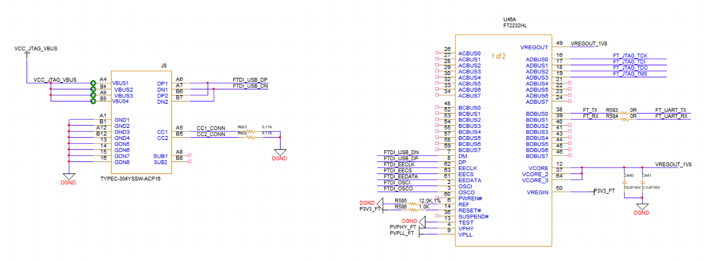

## 5，时钟配置

板上分别为 PS 系统和 PL 逻辑部分提供了有源时钟， PS 系统和 PL 逻辑可以单独工作。

### **5.1 PS**系统时钟源

ZYNQ 芯片通过开发板上的 X1 晶振为 PS 部分提供 33.333MHz 的时钟输入，3.3V 供电。时钟的输入连接到 ZYNQ 芯片的 BANK500 的 PS_CLK_500 的管脚上。其原理图如图 所示：

**时钟引脚分配：**

| **信号名称**   | **ZYNQ 引脚** |
| -------------- | ------------- |
| **PS_CLK_500** | F7            |

### **5.2 PL系统时钟源**

板上提供了单端 50MHz 的 PL 系统时钟源，3.3V 供电。晶振输出连接到FPGA 的全局时钟(MRCC)，这个 GCLK 可以用来驱动 FPGA 内的用户逻辑电路。该时钟源的原理图如图所示

**时钟引脚分配：**

| **信号名称** | ZYNQ 引脚 | ZYNQ IO 电平 |
| ------------ | --------- | ------------ |
| FPGA_CLK_50M | Y19       | 3.3V         |

## 6，PS端设计

### 6.1 启动模式配置

板卡支持三种启动模式。这三种启动模式分别是 JTAG 调试模式,QSPI FLASH 和 SD 卡启动模式。ZYNQ 芯片上电后会检测响应 MIO 口的电平来决定那种启动模式。用户可以通过核心板上的跳线来选择不同的启动模式 。

ZYNQ7000 完整的启动模式MIO配置如下表 （节选自UG585）：

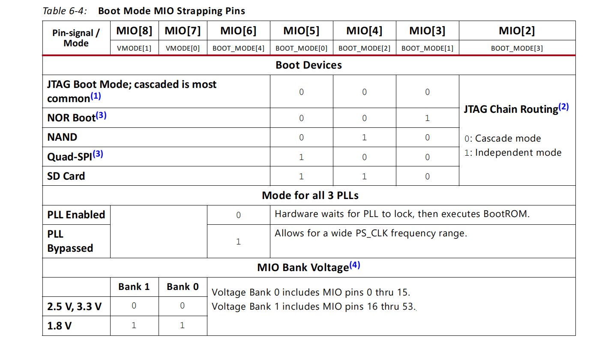

### 6.2 QSPI  FLASH

开发板配有一片 256Mbit 大小的 Quad-SPI FLASH 芯片，型号为 N25Q128A13ESE40F ，它使用3.3V CMOS 电压标准。由于 QSPI FLASH 的非易失特性，在使用中， 它可以作为系统的启动设备来存储系统的启动镜像。这些镜像主要包括 FPGA 的 bit 文件、ARM 的应用程序代码以及其它的用户数据文件。

SPI FLASH 连接到 ZYNQ 芯片的 PS 部分 BANK500 的 GPIO 口上，在系统设计中需要配置这些 PS 端的 GPIO 口功能为 QSPI FLASH 接口。

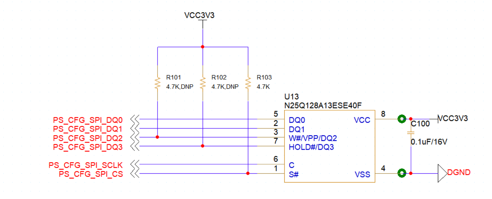

****

**配置芯片引脚分配：**

| 信号名称        | ZYNQ 引脚名 | ZYNQ 引脚号 | ZYNQ IO 电平 |
| --------------- | ----------- | ----------- | ------------ |
| PS_CFG_SPI_CS   | PS_MIO1_500 | A1          | 3.3V         |
| PS_CFG_SPI_DQ0  | PS_MIO2_500 | A2          | 3.3V         |
| PS_CFG_SPI_DQ1  | PS_MIO3_500 | F6          | 3.3V         |
| PS_CFG_SPI_DQ2  | PS_MIO4_500 | E4          | 3.3V         |
| PS_CFG_SPI_DQ3  | PS_MIO5_500 | A3          | 3.3V         |
| PS_CFG_SPI_SCLK | PS_MIO6_500 | A4          | 3.3V         |

### 6.3 EMMC 

板配有一片大容量的 8GB 大小的 eMMC FLASH 芯片，型号为MTFC8GAKAJCN-4M，它支持 JEDEC e-MMC V5.0 标准的 HS-MMC 接口，电平支持 1.8V或者 3.3V。eMMC FLASH 和 ZYNQ 连接的数据宽度为 4bit。

由于 eMMC FLASH 的大容量和非易失特性，在 ZYNQ 系统使用中，它可以作为系统大容量的存储设备，比如存储 ARM 的应用程序、系统文件以及其它的用户数据文件。

EMMC 连接到了 ZYNQ 的 PS 端接口，接口采用 SD 模式。EMMC 具备体积小，容量大，使用方便，速度快等优点，数据时钟可以达到 50MHZ。由于直接焊接在板上，因此可以在震动或者环境相对恶劣的场合使用。

eMMC FLASH 连接到 ZYNQ 的 PS 部分 BANK500 的 GPIO 口上，在系统设计中需要配置这些 PS 端的 GPIO 口功能为 EMMC 接口。

EMMC 的电路设计如下：

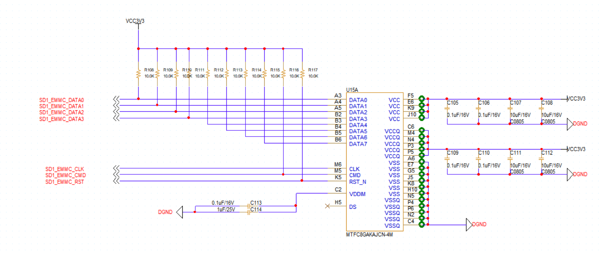

**EMMC 的参数如下:**

- 芯片类型:MTFC8GAKAJCN-4M
- 容量:8G Byte  
- 厂家:Micron

**EMMC芯片引脚分配：**

| 信号名称       | ZYNQ 引脚名 | ZYNQ 引脚号 | ZYNQ IO 电平 |
| -------------- | ----------- | ----------- | ------------ |
| SD1_EMMC_DATA0 | PS_MIO10    | G7          | 3.3V         |
| SD1_EMMC_DATA1 | PS_MIO13    | A6          | 3.3V         |
| SD1_EMMC_DATA2 | PS_MIO14    | B6          | 3.3V         |
| SD1_EMMC_DATA3 | PS_MIO15    | E6          | 3.3V         |
| SD1_EMMC_CLK   | PS_MIO12    | C5          | 3.3V         |
| SD1_EMMC_CMD   | PS_MIO11    | B4          | 3.3V         |
| SD1_EMMC_RST   | PS_MIO9     | C4          | 3.3V         |

### 6.4 以太网 

板上通过 Realtek RTL8211E-VL 以太网 PHY 芯片用户提供网络通信服务。

RTL8211E是Realtek瑞昱推出的一款高集成的网络接收PHY芯片，它符合10Base-T，100Base-TX和1000Base-T IEEE802.3标准，该芯片在网络通信中属于物理层，用于MAC与PHY之间的数据通信。目前有RTL8211E-VB-CG、RTL8211E-VL-CG、RTL8211EG-VB-CG等三个版本。 

以太网 PHY 芯片是连接到 ZYNQ 的 PS 端 BANK501 的 GPIO 接口上。RTL8211E-VL 芯片支持 10/100/1000 Mbps 网络传输速率，通过 RGMII 接口跟 Zynq7000 PS 系统的 MAC 层进行数据通信。RTL8211E-VL 支持ＭDI/MDX 自适应，各种速度自适应，Master/Slave 自适应，支持 MDIO 总线进行 PHY 的寄存器管理。

RTL8211E的电路设计如下：

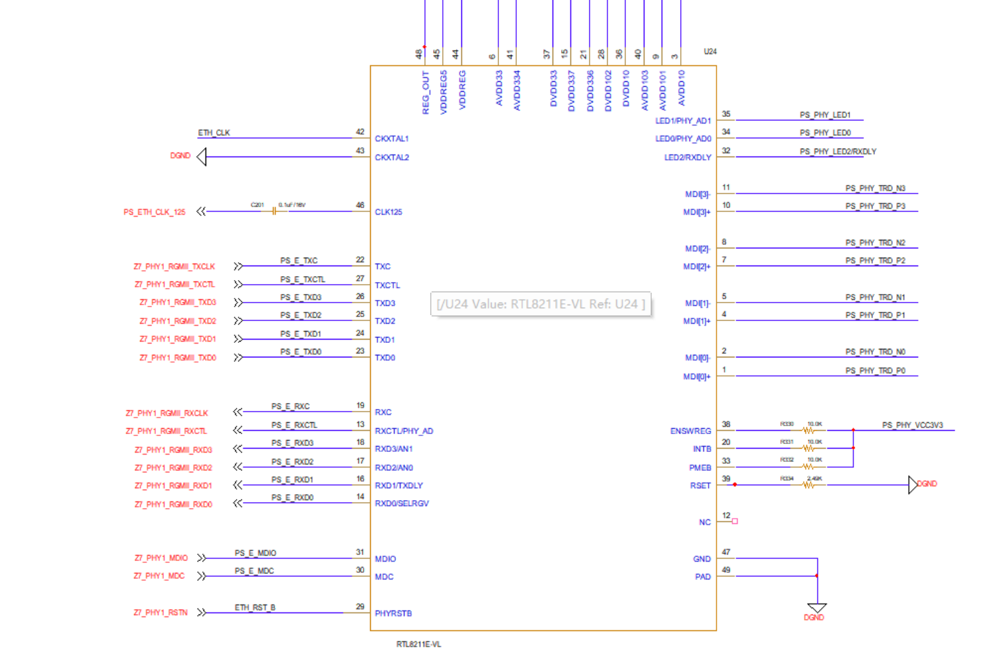

RTL8211E-VL 上电会检测一些特定的 IO 的电平状态，从而确定自己的工作模式。配置电路以及配置项如下图所示：

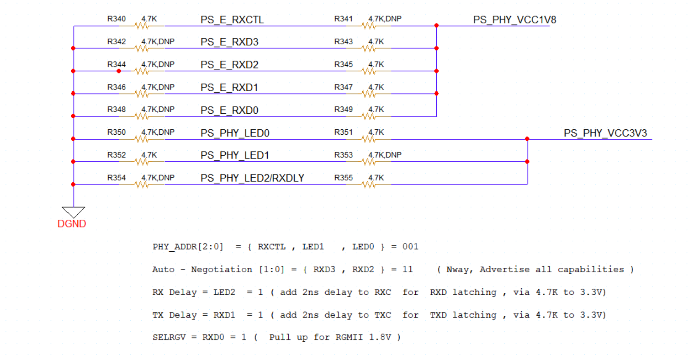

 当网络连接到千兆以太网时，FPGA 和 PHY 芯片 RTL8211E-VL 的数据传输时通过 RGMII总线通信，传输时钟为 125Mhz，数据在时钟的上升沿和下降样采样。

当网络连接到百兆以太网时，FPGA 和 PHY 芯片 RTL8211E-VL 的数据传输时通过 RMII总线通信，传输时钟为 25Mhz。数据在时钟的上升沿和下降样采样。

**以太网引脚分配如下：**

| 信号名称  | ZYNQ 引脚名  | ZYNQ 引脚号 | ZYNQ IO 电平 | 备注             |
| --------- | ------------ | ----------- | ------------ | ---------------- |
| ETH_GCLK  | PS_MIO16_501 | D6          | 1.8V         | RGMII 发送时钟   |
| ETH_TXD0  | PS_MIO17_501 | E9          | 1.8V         | 发送数据 bit０   |
| ETH_TXD1  | PS_MIO18_501 | A7          | 1.8V         | 发送数据 bit1    |
| ETH_TXD2  | PS_MIO19_501 | E10         | 1.8V         | 发送数据 bit2    |
| ETH_TXD3  | PS_MIO20_501 | A8          | 1.8V         | 发送数据 bit3    |
| ETH_TXCTL | PS_MIO21_501 | F11         | 1.8V         | 发送使能信号     |
| ETH_RXCK  | PS_MIO22_501 | A14         | 1.8V         | RGMII 接收时钟   |
| ETH_RXD0  | PS_MIO23_501 | E11         | 1.8V         | 接收数据 Bit0    |
| ETH_RXD1  | PS_MIO24_501 | B7          | 1.8V         | 接收数据 Bit1    |
| ETH_RXD2  | PS_MIO25_501 | F12         | 1.8V         | 接收数据 Bit2    |
| ETH_RXD3  | PS_MIO26_501 | A13         | 1.8V         | 接收数据 Bit3    |
| ETH_RXCTL | PS_MIO27_501 | D7          | 1.8V         | 接收数据有效信号 |
| ETH_MDC   | PS_MIO52_501 | D10         | 1.8V         | MDIO 管理时钟    |
| ETH_MDIO  | PS_MIO53_501 | C12         | 1.8V         | MDIO 管理数据    |

### 6.5 DDR

板上配有两个的4Gbit（512MB）的DDR3芯片(共计8Gbit),型号为 MT41K256M16TW-107IT 。DDR的总线宽度共为32bit。该DDR3存储系统直接连接到了ZYNQ处理系统（PS）的BANK 502的存储器接口上。

DDR3 的硬件设计需要严格考虑信号完整性，在电路设计和 PCB 设计的时候已经充分考虑了匹配电阻/终端电阻,走线阻抗控制，走线等长控制， 保证 DDR3 的高速稳定的工作。

DDR的电路设计如下图 ：

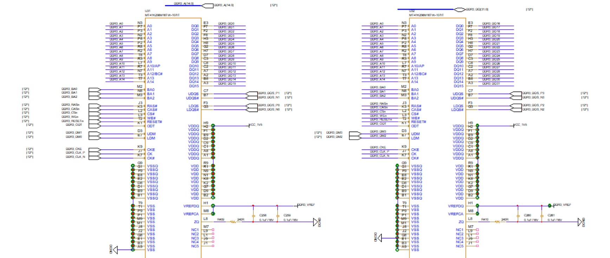

### 6.6 SD 卡

板包含了一个Micro型的SD卡接口，以提供用户访问SD卡存储器，用于存储ZYNQ芯片的BOOT程序，Linux操作系统内核, 文件系统以及其它的用户数据文件。
SDIO信号与ZYNQ的PS BANK501的IO信号相连，因为该BANK的VCCMIO设置为1.8V，但SD卡的数据电平为3.3V, 我们这里通过 MAX13035EETE+ 电平转换器来连接。

SD卡的电路设计如下：

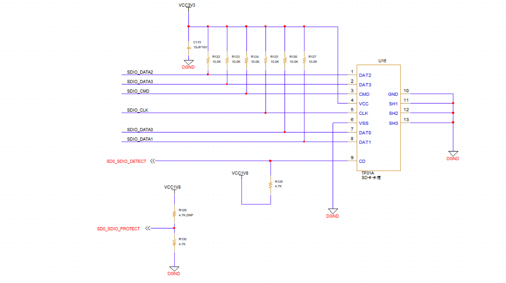

**SD 卡槽引脚分配**

| 信号名称       | ZYNQ 引脚名 | ZYNQ 引脚号 | ZYNQ IO 电平 | 备注         |
| -------------- | ----------- | ----------- | ------------ | ------------ |
| SD0_SDIO_CLK   | PS_MIO28    | A12         | 1.8V         | SD时钟信号   |
| SD0_SDIO_CMD   | PS_MIO29    | E8          | 1.8V         | SD命令信号   |
| SD0_SDIO_D0    | PS_MIO30    | A11         | 1.8V         | SD数据Data0  |
| SD0_SDIO_DATA1 | PS_MIO31    | F9          | 1.8V         | SD数据Data1  |
| SD0_SDIO_DATA2 | PS_MIO32    | C7          | 1.8V         | SD数据Data2  |
| SD0_SDIO_DATA3 | PS_MIO33    | G13         | 1.8V         | SD数据Data3  |
| SD0_SDIO_CATAD | PS_MIO34    | B12         | 1.8V         | SD卡插入信号 |

### 6.7 USB

板卡使用的USB2.0收发器是一个1.8V的，高速的支持ULPI标准接口的USB3320C-EZK。ZYNQ的USB总线接口和USB3320C-EZK收发器相连接，实现高速的USB2.0 Host模式和Slave模式的数据通信。USB3320C的USB的数据和控制信号连接到ZYNQ芯片PS端的BANK501的IO口上 。

**USB2.0 引脚分配 ：**

| 信号名称   | ZYNQ 引脚名 | ZYNQ 引脚号 | 备注             |
| ---------- | ----------- | ----------- | ---------------- |
| OTG_DATA4  | PS_MIO40    | E14         | USB 数据 Bit4    |
| OTG_DIR    | PS_MIO41    | C8          | USB 数据方向信号 |
| OTG_STP    | PS_MIO42    | D8          | USB 停止信号     |
| OTG_NXT    | PS_MIO43    | B11         | USB 下一数据信号 |
| OTG_DATA0  | PS_MIO44    | E13         | USB 数据 Bit0    |
| OTG_DATA1  | PS_MIO45    | B9          | USB 数据 Bit1    |
| OTG_DATA2  | PS_MIO46    | D12         | USB 数据 Bit2    |
| OTG_DATA3  | PS_MIO47    | B10         | USB 数据 Bit3    |
| OTG_CLK    | PS_MIO48    | D11         | USB 时钟信号     |
| OTG_DATA5  | PS_MIO49    | C14         | USB 数据 Bit5    |
| OTG_DATA6  | PS_MIO50    | D13         | USB 数据 Bit6    |
| OTG_DATA7  | PS_MIO51    | C10         | USB 数据 Bit7    |
| OTG_RESETN | PS_MIO39    | C13         | USB 复位信号     |

## 7，PL端外设

### 7.1 LED 

板卡设计有4 个用户发光二极管 LED，包括2个单色LED和2个RBG LED ，均连接在PL端进行控制 ; 

LED通过 TXS0108 电平转换芯片连接到FPGA的引脚 ， FPGA一侧的的IO电压为1.8V。当FPGA的IO电平为低时，LED点亮。

LED灯的电路设计如下 ;

**LED的 引脚分配 ：**

| 信号名称  | ZYNQ 引脚号 | ZYNQ IO 电平 | 备注               |
| --------- | ----------- | ------------ | ------------------ |
| PL_LED0   | B20         | 1.8V         | 单色LED0           |
| PL_LED1   | B21         | 1.8V         | 单色LED1           |
| PL_LED_R0 | A22         | 1.8V         | RGB_LED0的红色控制 |
| PL_LED_G0 | A21         | 1.8V         | RGB_LED0的绿色控制 |
| PL_LED_B0 | B22         | 1.8V         | RGB_LED0的蓝色控制 |
| PL_LED_R1 | E20         | 1.8V         | RGB_LED1的红色控制 |
| PL_LED_G1 | D21         | 1.8V         | RGB_LED1的绿色控制 |
| PL_LED_B1 | E21         | 1.8V         | RGB_LED1的蓝色控制 |

### 7.2 按键

板卡设计有 2 个 PL 控制按键 ,连接在PL端 , FPGA一侧的的IO电压为1.8V ，当按键按下时，FPGA侧检测到高电平，按键松开时，检测到低电平。按键的电路设计如下：

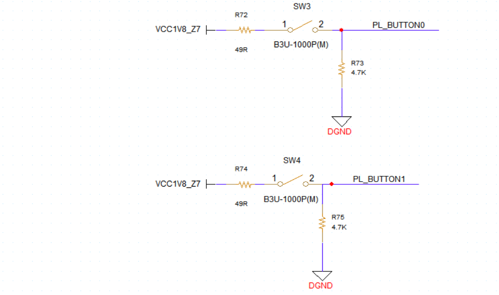

**按键的引脚分配如下：**

| 信号名称   | ZYNQ 引脚号 | ZYNQ IO 电平 | 备注 |
| ---------- | ----------- | ------------ | ---- |
| PL_BUTTON0 | C19         | 1.8V         |      |
| PL_BUTTON1 | C22         | 1.8V         |      |

### 7.3 编码开关

板卡设计有4个微型拨码开关，连接在PL端，FPGA一侧的的IO电压为1.8V  。

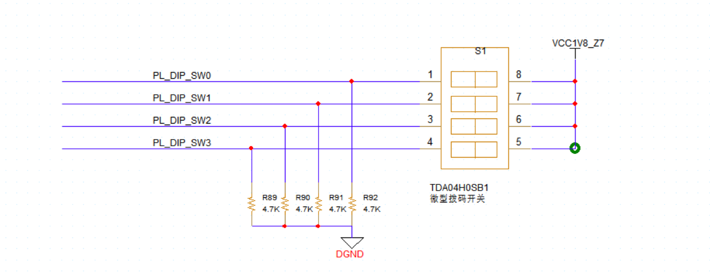

**编码开关的引脚分配如下：**

| 信号名称   | ZYNQ 引脚号 | ZYNQ IO 电平 | 备注 |
| ---------- | ----------- | ------------ | ---- |
| PL_DIP_SW0 | C20         | 1.8V         |      |
| PL_DIP_SW1 | D20         | 1.8V         |      |
| PL_DIP_SW2 | D22         | 1.8V         |      |
| PL_DIP_SW3 | E19         | 1.8V         |      |

### 7.4 调试串口

调试串口设计在PL端，连接到FT2232芯片的串口收发引脚上，IO电平为3.3V。

| 信号名称    | ZYNQ 引脚号 | ZYNQ IO 电平 | 备注            |
| ----------- | ----------- | ------------ | --------------- |
| PL_UART0_RX | V7          | 3.3V         | ZYNQ_UART的RX端 |
| PL_UART0_TX | V8          | 3.3V         | ZYNQ_UART的TX端 |

### 7.5 EEPROM

板卡设计有一片 IIC 接口的 EEPROM ，型号为 M24C08-WDW6TP ， 容量为 1Kbytes;

| 信号名称   | ZYNQ 引脚号 | ZYNQ IO 电平 | 备注 |
| ---------- | ----------- | ------------ | ---- |
| EEPROM_SDA | AB14        | 3.3V         |      |
| EEPROM_SCL | AB15        | 3.3V         |      |

### 7.6 风扇控制

板卡设计有一路风扇控制接口，12V供电，支持PWM风扇调速 。风扇的控制由 ZYNQ 芯片来控制，控制管脚连接到 FPGA的 IO ，如果 IO 电平输出为高，MOSFET 管导通，风扇工作，如果 IO 电平输出为低，风扇停止。板上的风扇设计图如下图 所示:

| 信号名称    | ZYNQ 引脚号 | ZYNQ IO 电平 | 备注              |
| ----------- | ----------- | ------------ | ----------------- |
| FAN_PWM_3V3 | W5          | 3.3V         | 风扇控制，PWM信号 |

### 7.7 OLED接口

板卡设计有OLCD屏幕接口，采用IIC接口，支持简单内容的显示。采用4PIN 2.54间距的单排排针，包括3.3V供电，地，SDA，SCL信号 。

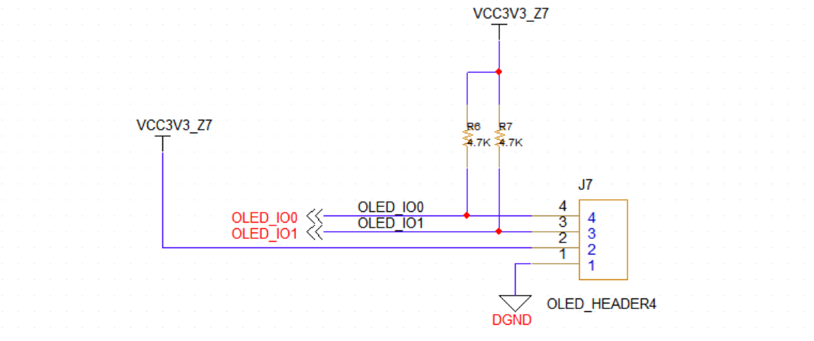

| 信号名称   | ZYNQ 引脚号 | ZYNQ IO 电平 | 备注 |
| ---------- | ----------- | ------------ | ---- |
| EEPROM_SDA | AB14        | 1.8V         |      |
| EEPROM_SCL | AB15        | 1.8V         |      |

### 7.8 温度传感器

板卡设计有一片IIC接口的温度传感器芯片，可用于检测环境温度。

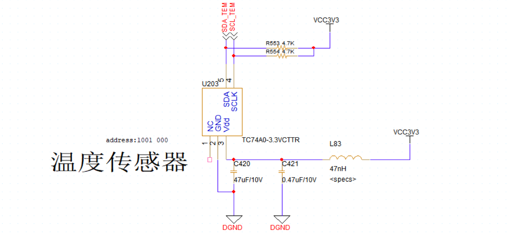

| 信号名称 | ZYNQ 引脚号 | ZYNQ IO 电平 | 备注 |
| -------- | ----------- | ------------ | ---- |
| SDA_TEM  | V22         | 3.3V         |      |
| SCL_TEM  | W22         | 3.3V         |      |

### 7.9 HDMI

板卡设计有一路 HDMI 图像视频输出接口, 能实现 1080P 的视频图像传输；开发板上通过 FPGA 的差分 IO直接连接到 HDMI 接口的差分信号和时钟，在 FPGA 内部实现 HMDI 信号的差分转并行再进行编解码，实现 DMI 数字视频输入和输出的传输解决方案，最高支持 1080P@60Hz 的输入和输出的功能。

板卡上采用 TPD12S016RKTR 芯片作为HDMI的接口防护芯片 。TPD12S016 是一款单芯片高清多媒体接口 (HDMI) 器件，具有自动方向感应 I2C 电压电平转换缓冲器、负载开关和集成式低电容高速静电放电 (ESD) 瞬态电压抑制 (TVS) 保护二极管。通过 55mA 限流 5V 输出 (5V_OUT) 为 HDMI 电力线供电。5V_OUT 和热插拔检测 (HPD) 电路的控制与 LS_OE 控制信号无关，其通过 CT_HPD 引脚进行控制，使得在启用 HDMI 链路前即可激活检测方案（5V_OUT 和 HPD）。SDA、SCL 和 CEC 线路上拉到 A 侧的 VCCA。在 B 侧，CEC_B 引脚上拉到内部 3.3V 电源轨，SCL_B 和 SDA_B 均上拉到 5V 电源轨 (5V_OUT)。SCL 和 SDA 引脚满足 I2C 规范，可驱动高达 750pF 电容负载，超出了 HDMI 1.4 规范。HPD_B 端口配有毛刺脉冲滤波器，可在插入 HDMI 连接器时避免由插座跳起引起的错误检测。TPD12S016 的 5V_OUT 引脚具有反向电流阻断功能。系统断电时，SCL_B、SDA_B 和 CEC_B 引脚也具有反向电流阻断功能。

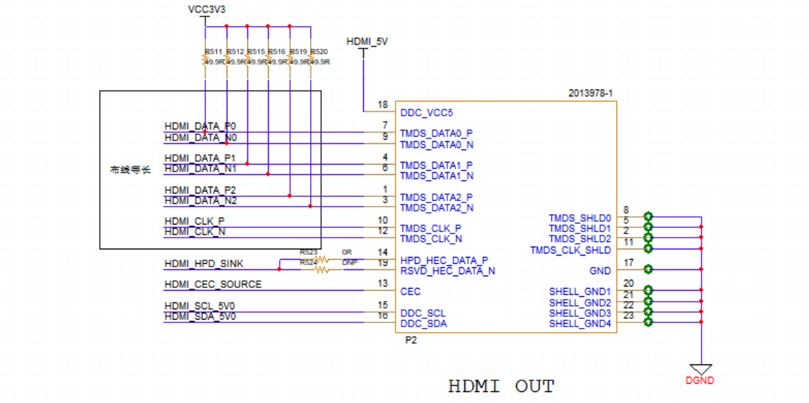

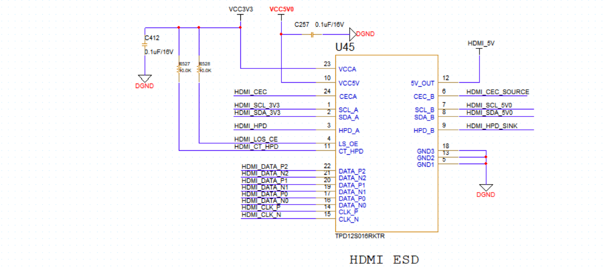

HDMI接口的引脚定义如下 ：

| 信号名称     | ZYNQ 引脚号 | ZYNQ IO 电平 | 备注 |
| ------------ | ----------- | ------------ | ---- |
| HDMI_CLK_P   | L18         | 3.3V         |      |
| HDMI_CLK_N   | L19         | 3.3V         |      |
| HDMI_DATA_P0 | M15         | 3.3V         |      |
| HDMI_DATA_N0 | M16         | 3.3V         |      |
| HDMI_DATA_P1 | J15         | 3.3V         |      |
| HDMI_DATA_N1 | K15         | 3.3V         |      |
| HDMI_DATA_P2 | K16         | 3.3V         |      |
| HDMI_DATA_N2 | L16         | 3.3V         |      |
| HDMI_LOS_CE  | P16         | 3.3V         |      |
| HDMI_CT_HPD  | H15         | 3.3V         |      |
| HDMI_HPD     | P15         | 3.3V         |      |
| HDMI_SCL_3V3 | R16         | 3.3V         |      |
| HDMI_SDA_3V3 | R15         | 3.3V         |      |
| HDMI_CEC     | N15         | 3.3V         |      |

### 7.10 RGB_LCD

板卡设计有LCD屏幕接口，采用RGB888时序接口，支持显示屏幕以及触摸功能 。采用FPC连接器和屏幕相连接，FPC引脚定义兼容正点原子的LCD RGB屏幕接口，用户可自行购买正点原子的RGB LCD显示屏幕进行开发调试 。

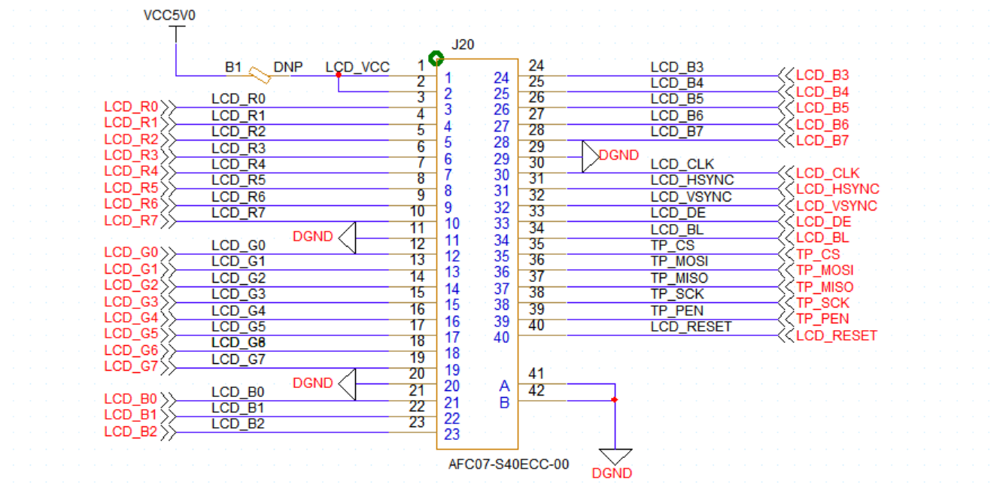

RGB_LCD接口的引脚定义如下 ：

| 信号名称  | ZYNQ 引脚号 | ZYNQ IO 电平 | 备注                            |
| --------- | ----------- | ------------ | ------------------------------- |
| LCD_R0    | W21         | 3.3V         | 8 位 RED 数据线0                |
| LCD_R1    | V20         | 3.3V         | 8 位 RED 数据线1                |
| LCD_R2    | AB22        | 3.3V         | 8 位 RED 数据线2                |
| LCD_R3    | W20         | 3.3V         | 8 位 RED 数据线3                |
| LCD_R4    | AB21        | 3.3V         | 8 位 RED 数据线4                |
| LCD_R5    | AA22        | 3.3V         | 8 位 RED 数据线5                |
| LCD_R6    | Y21         | 3.3V         | 8 位 RED 数据线6                |
| LCD_R7    | AA21        | 3.3V         | 8 位 RED 数据线7                |
| LCD_G0    | Y20         | 3.3V         | 8 位 GREEN 数据线0              |
| LCD_G1    | AB20        | 3.3V         | 8 位 GREEN 数据线1              |
| LCD_G2    | V18         | 3.3V         | 8 位 GREEN 数据线2              |
| LCD_G3    | AA18        | 3.3V         | 8 位 GREEN 数据线3              |
| LCD_G4    | AB17        | 3.3V         | 8 位 GREEN 数据线4              |
| LCD_G5    | AA17        | 3.3V         | 8 位 GREEN 数据线5              |
| LCD_G6    | AB16        | 3.3V         | 8 位 GREEN 数据线6              |
| LCD_G7    | AA16        | 3.3V         | 8 位 GREEN 数据线7              |
| LCD_B0    | Y16         | 3.3V         | 8 位 BLUE 数据线0               |
| LCD_B1    | Y15         | 3.3V         | 8 位 BLUE 数据线1               |
| LCD_B2    | U21         | 3.3V         | 8 位 BLUE 数据线2               |
| LCD_B3    | U20         | 3.3V         | 8 位 BLUE 数据线3               |
| LCD_B4    | U19         | 3.3V         | 8 位 BLUE 数据线4               |
| LCD_B5    | V19         | 3.3V         | 8 位 BLUE 数据线5               |
| LCD_B6    | Y18         | 3.3V         | 8 位 BLUE 数据线6               |
| LCD_B7    | V17         | 3.3V         | 8 位 BLUE 数据线7               |
| LCD_CLK   | W16         | 3.3V         | 像素时钟。                      |
| LCD_HSYNC | W15         | 3.3V         | 水平同步信号。                  |
| LCD_VSYNC | AA14        | 3.3V         | 垂直同步信号。                  |
| LCD_DE    | Y14         | 3.3V         | 数据使能信号。                  |
| LCD_BL    | V15         | 3.3V         | 背光控制信号。                  |
| LCD_RESET | U16         | 3.3V         | LCD 复位信号（低电平有效）      |
| TP_CS     | U22         | 3.3V         | 电容触摸屏复位信号(CT_RST)      |
| TP_MOSI   | U17         | 3.3V         | 电容触摸屏 IIC_SDA 信号(CT_SDA) |
| TP_MISO   | T21         | 3.3V         | NC，电容触摸屏未用到            |
| TP_SCK    | V13         | 3.3V         | 电容触摸屏 IIC_SCL 信号(CT_SCL) |
| TP_PEN    | T22         | 3.3V         | 电容触摸屏中断信号(CT_INT)      |

### 7.11 扩展口

扩展口 J2 和J30J均为 40 管脚的 2.54mm 的双排连接器，为用户扩展更多的外设和接口，扩展口上包含 5V 电源 1 路，3.3V 电源 2 路，地 3 路，IO 口 34 路。IO 口的信号连接到 ZYNQ PL 的 BANK13 和 BANK34 上，电平为 3.3V。

**切勿直接跟 5V 设备直接连接，以免烧坏 FPGA。如果要接 5V 设备，需要接电平转换芯片。**

在扩展口和 FPGA 连接之间串联了 ESD （Electro-Static discharge ，   静电放电）  防护芯片 ，用于保护 FPGA 以免外界电压或电流过高造成损坏。

PCB 设计上 P 和 N 的走线使用差分走线，控制差分阻抗为 100 欧姆。扩展口(J2 J3)，ESD的电路如图 下所示：

J2 扩展口原理图

J3 扩展口原理图

ESD防护芯片原理图（部分）

ESD防护芯片具有静电和浪涌保护功能，选用型号为：RCLAMP0524P ， 具体的参数如下。

|            属性             |         参数值          |
| :-------------------------: | :---------------------: |
|          商品类型           | 静电和浪涌保护(TVS/ESD) |
|     反向截止电压(Vrwm)      |           5V            |
|        最大钳位电压         |           12V           |
| 峰值脉冲电流(Ipp)@10/1000us |       3.5A@8/20us       |
|          击穿电压           |          5.5V           |
|            类型             |           TVS           |

**J2扩展口引脚分配**

| J2引脚 | 信号名称  | ZYNQ引脚名 | ZYNQ引脚号 |         备注         |
| :----: | :-------: | :--------: | :--------: | :------------------: |
|  PIN1  |    GND    |            |            |          地          |
|  PIN2  |  VCC5V0   |            |            |     5.0V电源输出     |
|  PIN3  |  IO0_N1   |            |    W12     |                      |
|  PIN4  |  IO0_P1   |            |    V12     |                      |
|  PIN5  |  IO0_N2   |            |    AB12    |                      |
|  PIN6  |  IO0_P2   |            |    AA12    |                      |
|  PIN7  |  IO0_N3   |            |    Y10     |                      |
|  PIN8  |  IO0_P3   |            |    Y11     |                      |
|  PIN9  |  IO0_N4   |            |    AB11    |                      |
| PIN10  |  IO0_P4   |            |    AA11    |                      |
| PIN11  |  IO0_N13  |            |     U9     |                      |
| PIN12  |  IO0_P13  |            |    U10     |                      |
| PIN13  | IO0_N6_CC |            |    AA8     | 连接到ZYNQ的CC引脚上 |
| PIN14  | IO0_P6_CC |            |    AA9     | 连接到ZYNQ的CC引脚上 |
| PIN15  | IO0_N7_CC |            |     Y8     | 连接到ZYNQ的CC引脚上 |
| PIN16  | IO0_P7_CC |            |     Y9     | 连接到ZYNQ的CC引脚上 |
| PIN17  | IO0_N8_CC |            |     Y5     | 连接到ZYNQ的CC引脚上 |
| PIN18  | IO0_P8_CC |            |     Y6     | 连接到ZYNQ的CC引脚上 |
| PIN19  |  IO0_N9   |            |    W10     |                      |
| PIN20  |  IO0_P9   |            |    W11     |                      |
| PIN21  |  IO0_N10  |            |    AB4     |                      |
| PIN22  |  IO0_P10  |            |    AB5     |                      |
| PIN23  |  IO0_N5   |            |    AB9     |                      |
| PIN24  |  IO0_P5   |            |    AB10    |                      |
| PIN25  |  IO0_N12  |            |    AA4     |                      |
| PIN26  |  IO0_P12  |            |     Y4     |                      |
| PIN27  |  IO0_N11  |            |     V9     |                      |
| PIN28  |  IO0_P11  |            |    V10     |                      |
| PIN29  |  IO0_N14  |            |    AB1     |                      |
| PIN30  |  IO0_P14  |            |    AB2     |                      |
| PIN31  |  IO0_N16  |            |    AB6     |                      |
| PIN32  |  IO0_P16  |            |    AB7     |                      |
| PIN33  |  IO0_N15  |            |    AA6     |                      |
| PIN34  |  IO0_P15  |            |    AA7     |                      |
| PIN35  |  IO0_N17  |            |     V4     |                      |
| PIN36  |  IO0_P17  |            |     V5     |                      |
| PIN37  |   DGND    |     -      |     -      |          地          |
| PIN38  |   DGND    |     -      |     -      |          地          |
| PIN39  |  VCC3V3   |     -      |     -      |     3.3V电源输出     |
| PIN40  |  VCC3V3   |     -      |     -      |     3.3V电源输出     |

**J3扩展口引脚分配**

| J3引脚 | 信号名称 | ZYNQ引脚名 | ZYNQ引脚号 | 备注                 |
| :----: | :------: | :--------: | :--------: | -------------------- |
|  PIN1  |   GND    |     -      |     -      | 地                   |
|  PIN2  |  VCC5V0  |     -      |     -      | 5.0V电源输出         |
|  PIN3  | IO0_N18  |            |    K18     |                      |
|  PIN4  | IO0_P18  |            |    J18     |                      |
|  PIN5  | IO0_N19  |            |    J17     |                      |
|  PIN6  | IO0_P19  |            |    J16     |                      |
|  PIN7  | IO0_N20  |            |    M17     |                      |
|  PIN8  | IO0_P20  |            |    L17     |                      |
|  PIN9  | IO0_N21  |            |    J22     |                      |
| PIN10  | IO0_P21  |            |    J21     |                      |
| PIN11  | IO0_N22  |            |    M18     |                      |
| PIN12  | IO0_P22  |            |    N18     |                      |
| PIN13  | IO0_N23  |            |    K20     | 连接到ZYNQ的CC引脚上 |
| PIN14  | IO0_P23  |            |    K19     | 连接到ZYNQ的CC引脚上 |
| PIN15  | IO0_N24  |            |    N20     | 连接到ZYNQ的CC引脚上 |
| PIN16  | IO0_P24  |            |    N19     | 连接到ZYNQ的CC引脚上 |
| PIN17  | IO0_N25  |            |    M20     | 连接到ZYNQ的CC引脚上 |
| PIN18  | IO0_P25  |            |    M19     | 连接到ZYNQ的CC引脚上 |
| PIN19  | IO0_N26  |            |    R21     |                      |
| PIN20  | IO0_P26  |            |    R20     |                      |
| PIN21  | IO0_N27  |            |    L22     |                      |
| PIN22  | IO0_P27  |            |    L21     |                      |
| PIN23  | IO0_N28  |            |    T19     |                      |
| PIN24  | IO0_P28  |            |    R19     |                      |
| PIN25  | IO0_N29  |            |    M22     |                      |
| PIN26  | IO0_P29  |            |    M21     |                      |
| PIN27  | IO0_N30  |            |    P18     |                      |
| PIN28  | IO0_P30  |            |    P17     |                      |
| PIN29  | IO0_N31  |            |    P22     |                      |
| PIN30  | IO0_P31  |            |    N22     |                      |
| PIN31  | IO0_N32  |            |    T17     |                      |
| PIN32  | IO0_P32  |            |    T16     |                      |
| PIN33  | IO0_N33  |            |    P21     |                      |
| PIN34  | IO0_P33  |            |    P20     |                      |
| PIN35  | IO0_N34  |            |    T18     |                      |
| PIN36  | IO0_P34  |            |    R18     |                      |
| PIN37  |   DGND   |     -      |     -      | 地                   |
| PIN38  |   DGND   |     -      |     -      | 地                   |
| PIN39  |  VCC3V3  |     -      |     -      | 3.3V电源输出         |
| PIN40  |  VCC3V3  |     -      |     -      | 3.3V电源输出         |

## 8，板卡接口汇总

