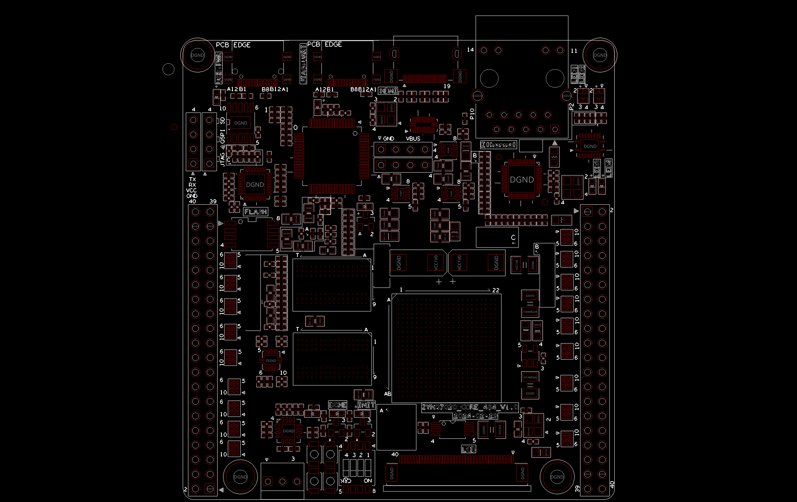
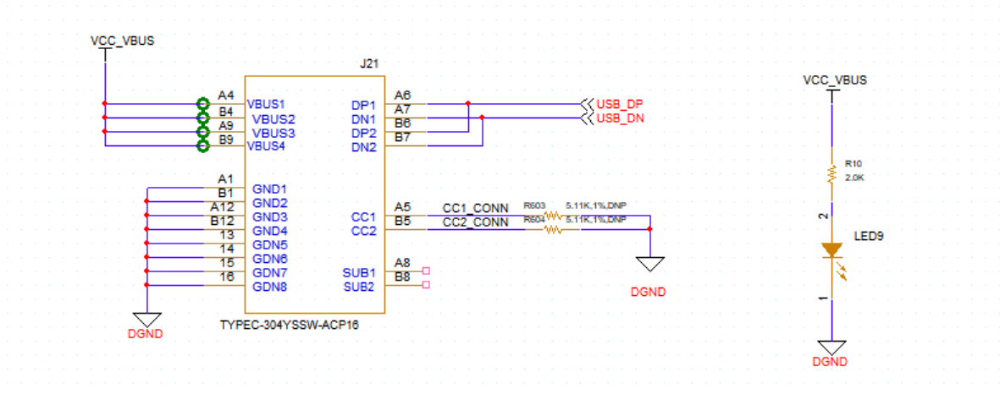
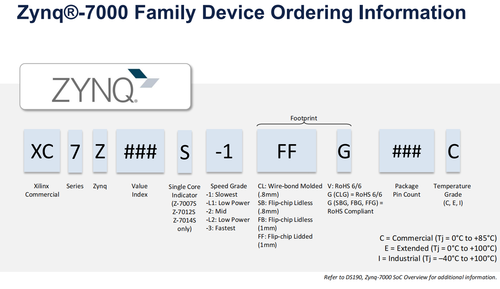
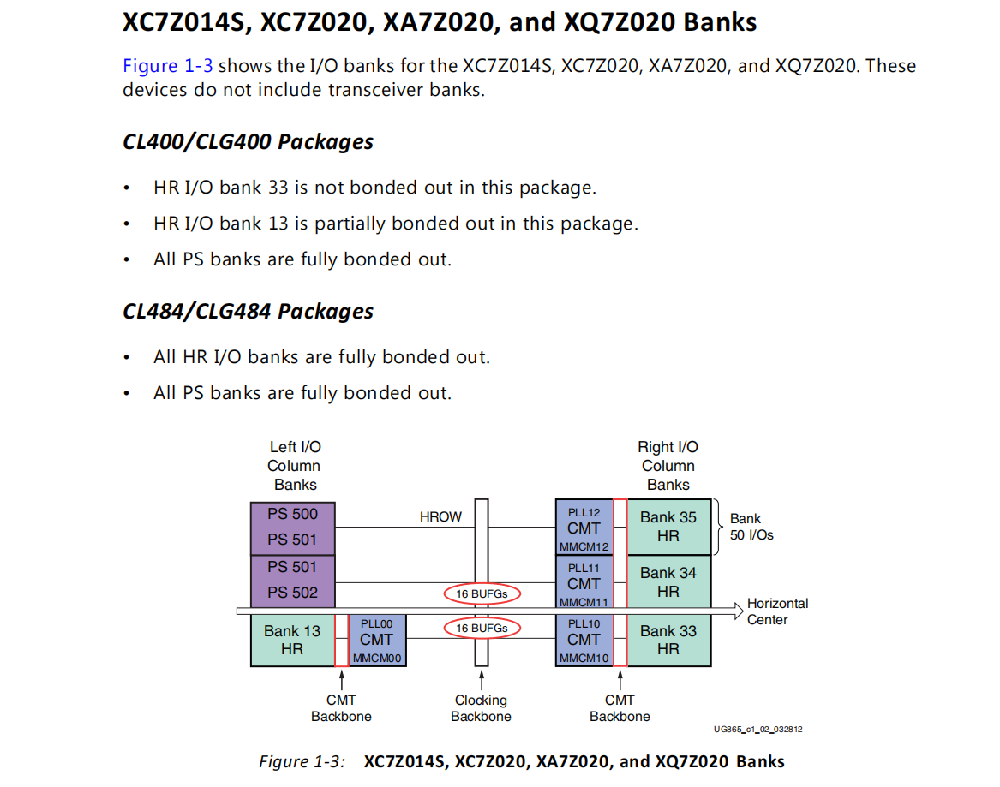
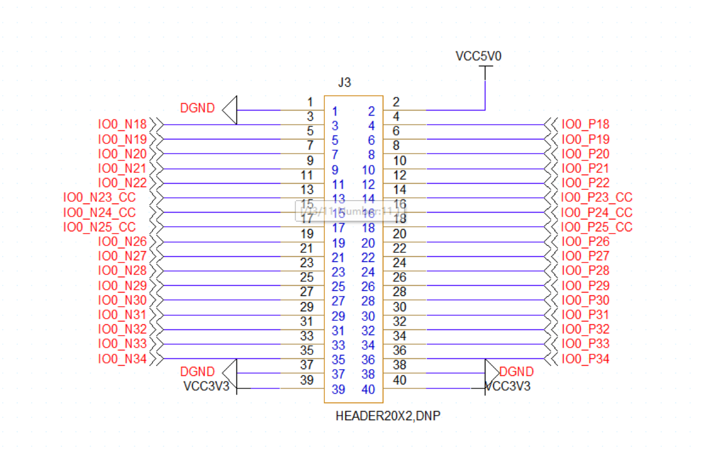
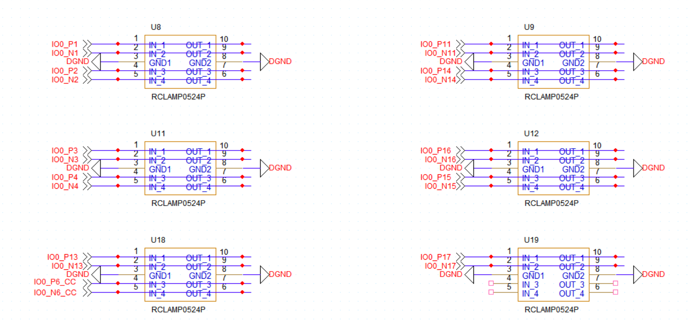

## 1，板卡概述**

此款开发板使用的是 Xilinx 公司的 Zynq7000 系列的芯片，型号为 XC7Z020-2CLG484I，484 个引脚的 FBGA 封装。ZYNQ7000 芯片可成处理器系统部分 Processor System（PS）和可编程逻辑部分 Programmable Logic（PL）。在 该开发板上，ZYNQ7000 的 PS部分和 PL 部分都搭载了丰富的外部接口和设备，方便用户的使用和功能验证。另外开发板上集成了 JTAG_UART 下载器电路，用户只用一个 USB 线就可以对开发板进行下载和调试。下图为整个板卡的系统组成图 ：

该开发平台定位于初学者的入门学习以及功能开发验证使用。

开发平台所能含有的接口和功能如下：

- USB TYPE-C电源输入接口，支持DP协议电源输入 ，支持5V,9V,12V 等电压配置，默认输入配置为12V ；

- 采用 TI的型号为 TPS82130SILT的 MicroSiP 电源模块  ，为板上提供 1.0V， 1.5V，1.8V，3.3V，5.0V等多路供电 ；

- Xilinx ARM+FPGA 芯片 Zynq-7000 XC7Z020-2CLG484I

- 两片大容量的 4Gbit（共 8Gbit）高速 DDR3 SDRAM,可作为 ZYNQ 芯片数据的缓存，也可以作为操作系统运行的内存 ， DDR型号为 MT41K256M16TW-107IT 。

- 一片 256Mbit 的 QSPI FLASH, 可用作 ZYNQ 芯片的系统文件和用户数据的存储 ，flash型号为 N25Q128A13ESE40F ;

- 1 路 Micro SD 卡座，用于存储操作系统镜像和文件系统。

- 一片EMMC芯片  ，容量为 8Gbytes , 用于存储操作系统镜像和文件系统 ， 型号为 MTFC8GAKAJCN-4M。 

- 一路10/100M/1000M以太网RJ-45接口, 可用于和电脑或其它网络设备进行以太网数据交换;

- 一路 HDMI 图像视频输出接口, 能实现 1080P 的视频图像传输；

- 板载一个 33.333Mhz 的有源晶振，给 PS 系统提供稳定的时钟源，一个 50MHz 的有源晶振，为 PL 逻辑提供额外的时钟；

- 一路 USB JTAG 口，集成有JTAG和UART功能，通过 USB 线及板载的 JTAG 电路对 ZYNQ 系统进行调试和下载。

- 一片 IIC 接口的 EEPROM ，型号为 M24C08-WDW6TP ， 容量为 1Kbytes;

- 通过跳线帽进行启动模式修改，支持JTAG，SD卡，FLASH启动模式，方便用户开发调试 。

- 一路USB接口  ， 可用于开发板连接鼠标、键盘和 U 盘等 USB 外设;

- 2个FPGA状态指示灯（DONE ， INIT_B），用于方便查看FPGA的状态 。

- 2 个系统复位按键， 采用专用的复位芯片，用于控制芯片的系统复位 ；

- 4 个用户发光二极管 LED，包括2个单色LED和2个RBG LED ，均连接在PL端进行控制;

- 2 个 PL 控制按键，4个微型拨码开关，均连接在PL端。

- 一片IIC接口的温度传感器芯片，可用于检测环境温度。

- LCD屏幕接口，采用RGB888时序接口，支持显示屏幕 。

- 一路风扇控制接口，12V供电，支持PWM风扇调速 。

- 2 路 40 针的扩展口（2.54mm 间距），用于扩展 ZYNQ 的 PL 部分的 IO。

    

## **2，结构尺寸**

开发板的尺寸为精简的 80mm x 75mm, PCB 采用 10 层板设计。板子四周有 4 个螺丝定位孔，用于固定开发板，定位孔的孔径为 2.5mm(直径），下图为整个板卡的结构示意图： 

板卡实物图如下 ：

## 3，电源设计

### 3.1 电源输入

采用USB TYPE-C电源输入为板卡供电，LED9为电源输入指示灯 ，当电源输入有效时，LED9点亮 。

### 3.2 PD协议

通过CH224K芯片提供 PD 供电支持 ，支持5V,9V,12V 等电压请求，默认输入配置为12V 。

 CH224 单芯片集成 USB PD 等多种快充协议，支持 PD3.0/2.0，BC1.2 等升压快充协议，支持 4V 至 22V 输入电压，自动检测VCONN 及模拟 E-Mark 芯片，最高支持 100W 功率，内置 PD 通讯模块，集成度高，外围精简。集成输出电压检测功能，并且提供过温、过压保护等功能。可广泛应用于各类电子设备拓展高功率输入如无线充电器、电动牙刷、充电剃须刀、锂电池电动工具等各类应用场合。

CH224K 使用 Type-C 母口供电，电平配置支持 5/9/12/15/20V（图中电平方式配置为 12v），通过修改 CFG1 ，CFG2，CFG3的连接关系来配置请求电压 ，用户可修改 CFG 引脚的配置来调整输入请求电压 。 实际请求的电压取决于电源适配器支持的输出模式  。

### 3.3 排针供电

板卡还设计有一路排针的电源接口 ，可作为电源输入或输出使用 。排针位号为 J6 ， 为 2.54mm 间距的 4PIN 单排排针 。

当用户不方便使用 Type-C 接口供电时， 也可使用该排针接口为板卡进行供电 ，输入电压支持  5V- 15V 范围 。

或者使用 Type-C 接口供电时，该接口也可支持为其他模块提供供电 。

### 3.4 电源模块 

采用 TI的型号为 TPS82130SILT的 MicroSiP 电源模块  ，为板上提供 1.0V， 1.5V，1.8V，3.3V，5.0V等多路供电 ；通过 TI 的 TPS51200 生成 DDR3 需要的 VTT 和 VREF 电压。

TPS82130 是一款 17V 输入 3A 降压转换器 MicroSiP 电源模块，经优化具有小解决方案尺寸和高效率等特性。该模块集成了一个同步降压转换器和一个电感器，以简化设计、减少外部元件数量并缩小 PCB 面积。该模块采用紧凑的薄型封装，适合通过标准表面贴装设备进行自动组装。

TPS51200 器件是一款灌电流和拉电流双倍数据速率 (DDR) 终端稳压器，专门针对低输入电压、低成本、低噪声的空间受限型系统而设计。

各个电源分配的功能如下表所示：

| **电源**  | **功能**                                                     |
| --------- | ------------------------------------------------------------ |
| +1.0V     | ZYNQ的核心电压                                               |
| +1.5V     | DDR3 ,  ZYNQ Bank502                                         |
| +1.8V     | ZYNQ 辅助电压, ZYNQ PLL, ZYNQ Bank501 VCCIO, 以太网，USB2.0 等 |
| +3.3V     | ZYNQ  VCCIO, 以太网，串口，HDMI ，FLASH,  EEPROM  ，  SD card 等 |
| +5.0V     | LCD ，HDMI ， 扩展接口                                       |
| VREF, VTT | DDR3                                                         |

因为 ZYNQ 的 PS 和 PL 部分的电源有上电顺序的要求，在电路设计中，按照ZYQN 的电源要求设计，上电依次为 1.0V -> 1.5V -> 1.8 V -> 3.3V -> 5.0V 。下图为电源的电路设计：

## 4，ZYNQ7000

### 4.1 主芯片介绍

开发板使用的是 Xilinx 公司的 Zynq7000 系列的芯片，型号为 XC7Z020-2CLG484I。

zynq7000系列的结构如下图所示。芯片的 PS 系统集成了两个 ARM Cortex™-A9 处理器，AMBA®互连，内部存储器，外部存储器接口和外设，外设主要包括 USB 总线接口，以太网接口，SD/SDIO 接口，I2C 总线接口，CAN 总线接口，UART 接口，GPIO 等。

PL端结构与A7系列相似，大体就包括电源模块、时钟CMT、IO模块（IOB、GTP、memory interface、pcie）、CLB、BRAM、GTP、DSP、jtag调试口等。

PS端包含1个APU单元，APU内有两个cotex-a9核用于运算，一个SCU用于处理数据的一致性，然后包含L1、L2级缓存，一个GIC用于中断控制，一个256KB SRAM用于程序运行，另外包含TTC、看门狗、DAP调试口等。PS端还包含一个Central Interconnect，用于互连IOP（CAN、SPI、UART、SD、USB、ETHERNET等外设），互连flash，互连DDR，互连OCM Interconnect。PS端还包含clock生成模块、复位模块等。

### 4.2 ZYNQ7000命名规则

Zynq其命名规则遵循一定的规则和约定。型号由系列代号，数字序列，速度等级，封装类型，温度等级等部分组成， 例如，Zynq-7000系列包括Zynq-7010、Zynq-7020、Zynq-7030、Zynq-7040、Zynq-7100、等型号，其中数字和字母的组合表示不同的芯片性能等级，速度等级包括 -1 ，-L1，-2 ，-L2，-3等，温度等级支持商业级，工艺级等。详细内容见于下图 ：

### 4.3 芯片资源

**PS 系统部分的主要参数如下：**

- 基于 ARM 双核 CortexA9 的应用处理器
- 每个 CPU 32KB 1 级指令和数据缓存，512KB 2 级缓存 2 个 CPU 共享
- 片上 boot ROM 和 256KB 片内 RAM
- 外部存储接口，支持 16/32 bit DDR2、DDR3 接口
- 两个千兆网卡支持：发散-聚集 DMA ，GMII，RGMII，SGMII 接口
- 两个 USB2.0 OTG 接口，每个最多支持 12 节点
- 两个 CAN2.0B 总线接口
- 两个 SD 卡、SDIO、MMC 兼容控制器
- 2 个 SPI，2 个 UARTs，2 个 I2C 接口
- 4 组 32bit GPIO，54（32+22）作为 PS 系统 IO，64 连接到 PL
- PS 内和 PS 到 PL 的高带宽连接

**PL 逻辑部分的主要参数如下：**

- 逻辑单元 Logic Cells：85K
- 查找表 LUTs: 53,200
- 触发器(flip-flops): 106,400
- 乘法器 18x25MACCs：220
- Block RAM：4.9 Mb
- 两个 AD 转换器,可以测量片上电压、温度感应和高达 17 外部差分输入通道，最大转换速率为1MBPS

## 4.4 各bank电压

该主芯片的各个BANK功能以及BANK描述如下 ：

 FPGA的器件管脚按照Bank进行划分，每个Bank独立供电，以使FPGA I/O适应不同电压标准，增强I/O设计的灵活性。主芯片各个板卡的设计如下表：

| BANK    | 设计电压 | 备注             |
| ------- | -------- | ---------------- |
| BANK0   | 3.3V     | 配置BNAK         |
| BANK13  | 3.3V     | PL_IO ,  HR BANK |
| BANK33  | 3.3V     | PL_IO ,  HR BANK |
| BANK34  | 3.3V     | PL_IO ,  HR BANK |
| BANK35  | 3.3V     | PL_IO ,  HR BANK |
| BANK500 | 3.3V     | PS_MIO           |
| BANK501 | 1.8V     | PS_MIO           |
| BANK502 | 1.5V     | PS_DDR           |

## 5，PS端外设

## 6，PL端外设

### 扩展口

扩展口 J2 和J30J均为 40 管脚的 2.54mm 的双排连接器，为用户扩展更多的外设和接口，扩展口上包含 5V 电源 1 路，3.3V 电源 2 路，地 3 路，IO 口 34 路。IO 口的信号连接到 ZYNQ PL 的 BANK13 和 BANK34 上，电平为 3.3V。

**切勿直接跟 5V 设备直接连接，以免烧坏 FPGA。如果要接 5V 设备，需要接电平转换芯片。**

在扩展口和 FPGA 连接之间串联了 ESD （Electro-Static discharge ，   静电放电）  防护芯片 ，用于保护 FPGA 以免外界电压或电流过高造成损坏。

PCB 设计上 P 和 N 的走线使用差分走线，控制差分阻抗为 100 欧姆。扩展口(J2 J3)，ESD的电路如图 下所示：

J2 扩展口原理图

J3 扩展口原理图

ESD防护芯片原理图（部分）

ESD防护芯片具有静电和浪涌保护功能，选用型号为：RCLAMP0524P ， 具体的参数如下。

|            属性             |         参数值          |
| :-------------------------: | :---------------------: |
|          商品类型           | 静电和浪涌保护(TVS/ESD) |
|     反向截止电压(Vrwm)      |           5V            |
|        最大钳位电压         |           12V           |
| 峰值脉冲电流(Ipp)@10/1000us |       3.5A@8/20us       |
|          击穿电压           |          5.5V           |
|            类型             |           TVS           |

**J2扩展口引脚分配**

| J2引脚 | 信号名称  | ZYNQ引脚名 | ZYNQ引脚号 |         备注         |
| :----: | :-------: | :--------: | :--------: | :------------------: |
|  PIN1  |    GND    |            |            |          地          |
|  PIN2  |  VCC5V0   |            |            |     5.0V电源输出     |
|  PIN3  |  IO0_N1   |            |    W12     |                      |
|  PIN4  |  IO0_P1   |            |    V12     |                      |
|  PIN5  |  IO0_N2   |            |    AB12    |                      |
|  PIN6  |  IO0_P2   |            |    AA12    |                      |
|  PIN7  |  IO0_N3   |            |    Y10     |                      |
|  PIN8  |  IO0_P3   |            |    Y11     |                      |
|  PIN9  |  IO0_N4   |            |    AB11    |                      |
| PIN10  |  IO0_P4   |            |    AA11    |                      |
| PIN11  |  IO0_N13  |            |     U9     |                      |
| PIN12  |  IO0_P13  |            |    U10     |                      |
| PIN13  | IO0_N6_CC |            |    AA8     | 连接到ZYNQ的CC引脚上 |
| PIN14  | IO0_P6_CC |            |    AA9     | 连接到ZYNQ的CC引脚上 |
| PIN15  | IO0_N7_CC |            |     Y8     | 连接到ZYNQ的CC引脚上 |
| PIN16  | IO0_P7_CC |            |     Y9     | 连接到ZYNQ的CC引脚上 |
| PIN17  | IO0_N8_CC |            |     Y5     | 连接到ZYNQ的CC引脚上 |
| PIN18  | IO0_P8_CC |            |     Y6     | 连接到ZYNQ的CC引脚上 |
| PIN19  |  IO0_N9   |            |    W10     |                      |
| PIN20  |  IO0_P9   |            |    W11     |                      |
| PIN21  |  IO0_N10  |            |    AB4     |                      |
| PIN22  |  IO0_P10  |            |    AB5     |                      |
| PIN23  |  IO0_N5   |            |    AB9     |                      |
| PIN24  |  IO0_P5   |            |    AB10    |                      |
| PIN25  |  IO0_N12  |            |    AA4     |                      |
| PIN26  |  IO0_P12  |            |     Y4     |                      |
| PIN27  |  IO0_N11  |            |     V9     |                      |
| PIN28  |  IO0_P11  |            |    V10     |                      |
| PIN29  |  IO0_N14  |            |    AB1     |                      |
| PIN30  |  IO0_P14  |            |    AB2     |                      |
| PIN31  |  IO0_N16  |            |    AB6     |                      |
| PIN32  |  IO0_P16  |            |    AB7     |                      |
| PIN33  |  IO0_N15  |            |    AA6     |                      |
| PIN34  |  IO0_P15  |            |    AA7     |                      |
| PIN35  |  IO0_N17  |            |     V4     |                      |
| PIN36  |  IO0_P17  |            |     V5     |                      |
| PIN37  |   DGND    |     -      |     -      |          地          |
| PIN38  |   DGND    |     -      |     -      |          地          |
| PIN39  |  VCC3V3   |     -      |     -      |     3.3V电源输出     |
| PIN40  |  VCC3V3   |     -      |     -      |     3.3V电源输出     |

**J3扩展口引脚分配**

| J3引脚 | 信号名称 | ZYNQ引脚名 | ZYNQ引脚号 | 备注                 |
| :----: | :------: | :--------: | :--------: | -------------------- |
|  PIN1  |   GND    |     -      |     -      | 地                   |
|  PIN2  |  VCC5V0  |     -      |     -      | 5.0V电源输出         |
|  PIN3  | IO0_N18  |            |    K18     |                      |
|  PIN4  | IO0_P18  |            |    J18     |                      |
|  PIN5  | IO0_N19  |            |    J17     |                      |
|  PIN6  | IO0_P19  |            |    J16     |                      |
|  PIN7  | IO0_N20  |            |    M17     |                      |
|  PIN8  | IO0_P20  |            |    L17     |                      |
|  PIN9  | IO0_N21  |            |    J22     |                      |
| PIN10  | IO0_P21  |            |    J21     |                      |
| PIN11  | IO0_N22  |            |    M18     |                      |
| PIN12  | IO0_P22  |            |    N18     |                      |
| PIN13  | IO0_N23  |            |    K20     | 连接到ZYNQ的CC引脚上 |
| PIN14  | IO0_P23  |            |    K19     | 连接到ZYNQ的CC引脚上 |
| PIN15  | IO0_N24  |            |    N20     | 连接到ZYNQ的CC引脚上 |
| PIN16  | IO0_P24  |            |    N19     | 连接到ZYNQ的CC引脚上 |
| PIN17  | IO0_N25  |            |    M20     | 连接到ZYNQ的CC引脚上 |
| PIN18  | IO0_P25  |            |    M19     | 连接到ZYNQ的CC引脚上 |
| PIN19  | IO0_N26  |            |    R21     |                      |
| PIN20  | IO0_P26  |            |    R20     |                      |
| PIN21  | IO0_N27  |            |    L22     |                      |
| PIN22  | IO0_P27  |            |    L21     |                      |
| PIN23  | IO0_N28  |            |    T19     |                      |
| PIN24  | IO0_P28  |            |    R19     |                      |
| PIN25  | IO0_N29  |            |    M22     |                      |
| PIN26  | IO0_P29  |            |    M21     |                      |
| PIN27  | IO0_N30  |            |    P18     |                      |
| PIN28  | IO0_P30  |            |    P17     |                      |
| PIN29  | IO0_N31  |            |    P22     |                      |
| PIN30  | IO0_P31  |            |    N22     |                      |
| PIN31  | IO0_N32  |            |    T17     |                      |
| PIN32  | IO0_P32  |            |    T16     |                      |
| PIN33  | IO0_N33  |            |    P21     |                      |
| PIN34  | IO0_P33  |            |    P20     |                      |
| PIN35  | IO0_N34  |            |    T18     |                      |
| PIN36  | IO0_P34  |            |    R18     |                      |
| PIN37  |   DGND   |     -      |     -      | 地                   |
| PIN38  |   DGND   |     -      |     -      | 地                   |
| PIN39  |  VCC3V3  |     -      |     -      | 3.3V电源输出         |
| PIN40  |  VCC3V3  |     -      |     -      | 3.3V电源输出         |

